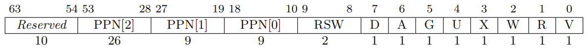
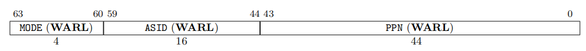
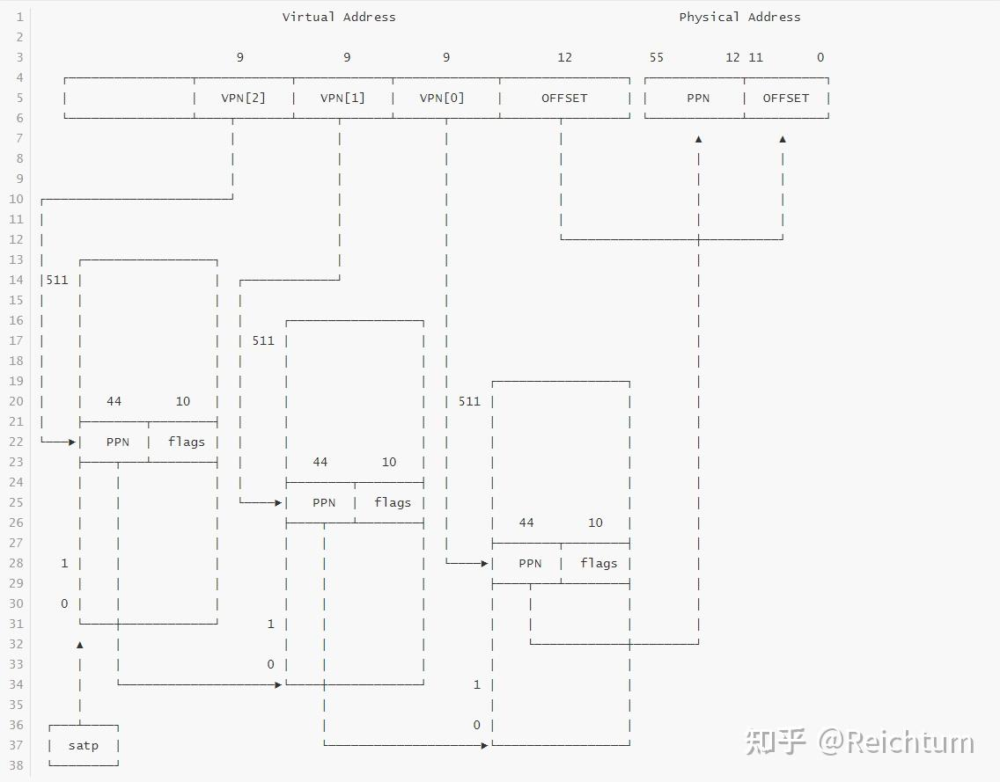

## sv39
`sv39`是`rv64`一种虚拟内存布局方式，用39bit来表示虚拟内存地址空间，可以表示最大512GB；由satp寄存器指定，sv39中使用三级页表查询，每级页表有`512`个页目录`pte`
- `VPN (virtual page number)`为虚拟内存地址索引
- `PPN(Physical page number)`为物理页号

## 页表
页表的目的，在于将不连续的内存变成连续的内存地址空间。页表提供了一个内存地址的抽象，让原本可能并不连续的内存在页表的映射下变成了连续的内存。此外，页表还能够为一个页设置访问权限，并记录页面的访问读写情况。

总结来说，页表有着以下好处：

- 重新映射地址与内存页，提供内存地址抽象；
- 设置访问权限（包括读/写/执行/用户态可用/全局可用等）；
- 记录页面访问/读写情况。

不过，我们注意到，如果我们要为每一个虚拟页建立映射，那么我们需要建立 2^64−2^12
 个映射，这会耗费大量的内存，而且一个程序只会使用很少的一部分虚拟地址空间。多级页表就是用来解决这个问题的。多级页表会从先按照虚拟地址的高位，映射到下一级页表中，如果这个虚拟地址没有被使用，那么下一级页表就无需存在。这样，很多个映射被合并到一个更高层次的映射，内存被大大节约了。而且，由于使用了多级页表，每一张页表占用的空间也比原来少了很多（在后面的 SV39 下一张页表是一个页的大小），因此避免了需要找到连续大内存的问题。

硬件会将最高级的页表地址记录在一个特权寄存器上（在 RISCV 上是 satp 寄存器，全称是 supervisor address translation and protection register）。当硬件想要知道一个虚拟地址在何处时（不考虑 TLB），会依次读取各级页表，翻译出物理内存的位置。

## SV39 多级页表机制
我们的内核使用的是 SV39 多级虚拟内存机制。SV39 采用三级页表映射，每一级控制 2^9
 个表项，`每个表项占用 8 bytes`，所以一张页表（无论哪一级）占用了 4 KiB，也就是一个页的大小。`下面是虚拟地址和物理地址的映射示意图`：（其中 VPN 表示 virtual page number，PPN 表示 physical page number）

```c
      38        30 29       21 20        12 11             0
      +-----------+-----------+------------+---------------+
      |   VPN[2]  |   VPN[1]  |   VPN[0]   |  page offset  |
      +-----------+-----------+------------+---------------+

55              30 29       21 20        12 11             0
+-----------------+-----------+------------+---------------+
|      PPN[2]     |   PPN[1]  |   PPN[0]   |  page offset  |
+-----------------+-----------+------------+---------------+

```
每一级页表控制 2^9=512 个表项，所以可以控制 9 bits 的地址空间。最后一级控制的是 4 KiB 的页面，所以我们一共可以控制 `12+9×3=39`bits 的虚拟地址空间，SV39 的 39 就是这样来的。

- VPN[2,1,0]:用于在多层页表中进行索引查询
- PPN[2,1,0]:合并最终的物理内存页号，没有什么分开的意义

## 页表项 pte(page table entry)
页表项，用于表示映射信息


- V：有效位，表示页表项是否 valid。
- R, W, X：这些位分别表示页面是否可读、可写和可执行。当所有三个都为零时，PTE 指向页面表的下一级；否则，它是一个 leaf PTE。
- U：用户位，表示对应虚拟页面是否可在用户态下访问。
- G：全局位，表示对应的页面是否是全局的。对于 non-leaf PTE，全局设置意味着页表后续级别中的所有映射都是全局的。请注意，未能将全局映射标记为全局只会降低性能，而将非全局映射标记为全局则是一个致命错误。
- A：访问位，表示对应的页面是否被访问过。
- D：脏位，表示对应的页面是否被写过。
- RSW：为内核程序预留，硬件不会对此做任何其他操作。

## SV39 映射举例
假设我们现在有一个地址 0x7FFFFFFFFF（也就是低 39 bits 都是 1，其他高位都是 0），我们来看看虚拟地址是如何映射的。

- 通过 satp 寄存器找到第一级页表；
- 翻译 30-38 这几位，找到第二级页表，如果发现这个地址非法，那么停止翻译，进入异常处理流程；
- 翻译 21-29 这几位，找到第三级页表，如果发现地址非法，处理同上；
- 翻译 12-20 这几位，找到对应的物理的 12-55 位。

翻译完成的物理内存有两部分，一部分是刚刚翻译的 12-55 位，另一部分是页面上的偏移，即虚拟地址的 0-11 位。


## satp寄存器
`satp(supervisor address translation and protection)` 寄存器是 `riscv` 指令集中的特权寄存器，专门用于控制内存分页

- PPN ：保存根物理页号，实际值为「根页表物理地址右移 12 位」
- ASID ：区分不同进程的地址空间，减少TLB刷新
- MODE ：用于选择分页模式，这里置为 8
```c
RV 64
	     ----------------------------------------------------------
	    |  Value  |  Name  |  Description                          |
	    |----------------------------------------------------------|
	    |    0    | Bare   | No translation or protection          |
	    |  1 - 7  | ---    | Reserved for standard use             |
	    |    8    | Sv39   | Page-based 39 bit virtual addressing  |
	    |    9    | Sv48   | Page-based 48 bit virtual addressing  |
	    |    10   | Sv57   | Page-based 57 bit virtual addressing  |
	    |    11   | Sv64   | Page-based 64 bit virtual addressing  |
	    | 12 - 13 | ---    | Reserved for standard use             |
	    | 14 - 15 | ---    | Reserved for standard use             |
	     -----------------------------------------------------------
```

## sfence.vma
虚拟地址屏障指令,需要注意sfence.vma和tlb flush不完全一样，sfence.vma可以根据参数来确定具体行为

sfence.vma 执行会受到一些状态的影响

- 不在S态时，将会触发非法指令异常，这很容易理解，毕竟是S模式的指令
- 当mstatus中的TVM位置位时，将会产生非法指令异常，这是一种
阻断机

## MMU的启动条件
- CPU不处于M态
- satp寄存器中Mode字段设置有效分页模式

一旦设置好了 `satp` 寄存器， CPU 就会自动启动虚拟内存， ld, sd 等访存指令访问虚拟内存时，处理器会自动重定位至其物理地址。


## Sv39 虚拟内存开启过程
首先给定虚拟地址 VA 和要映射的物理地址 PA ，还有根页表物理地址 TBA ，按以下过程初始化虚拟内存：

- 设置 satp 寄存器：将 mode 设置为 8 ，将 PPN 设置为 TBA >> 12
- 初始化根页表：根据 satp 寄存器的 PPN 得到根表项的地址，从 VA 中获取 VPN[2] 作为索引的表项，将 PPN[2-0] 设置为二级页表的物理页号。
- 初始化二级页表：以根页表中读出的 PPN << 12 作为二级页表的地址，从 VA 中获取 VPN[1] 作为索引的表项，设置 PPN[2-0] 为三级页表的物理页号。
- 三级页表初始化过程同二级页表一致。

## Sv39 寻址过程
- 第一层寻址：根据 satp 寄存器的 PPN 项获得根页表的物理地址，根据 VPN[2] 获得索引，获取第二层页表的物理地址。
- 第二、三层寻址：根据上一层页表的页表项中的 PPN 获得页表的物理地址，根据 VPN[1], VPN[0] 获得索引。


