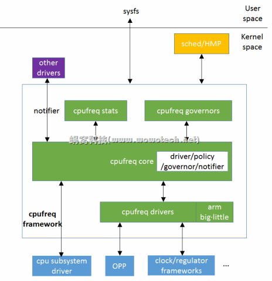

[toc]

# cpufreq


CPUFreq框架是内核的CPU调频框架，整个调频框架由以下几个部分组成：

- cpufreq driver
- cpufreq framework (core)
- cpufreq governor

一些基本概念：

P-state: voltage and frequency point

总体上，CPU Freq主要在sysfs向userspace提供了调频操作和策略设置节点。当使用一些自动调频的governor时，允许governor从系统获取信息，自动触发调频动作。

另外，还向其他模块提供了qos频率投票，以及调频事件的notifier机制。

下面分开来看每个部分。

## Driver


Cpufreq Driver主要负责底层调频的操作，核心是实现 `cpufreq_dirver` 对象，并通过 `cpufreq_register_driver` 将驱动注册到系统，供core部分使用。

其中，最核心的几个回调包括：

- online: hotplug callback
- offline: hotplug callback
- target_index: set freq
- set_boost: enter into boost mode

以 `mediatek-cpufreq-hw.c` 为例，其freq table保存在硬件寄存器中，driver初始化时，从硬件中读出freq table，并实现相关调频回调，最终注册到core。

db845c使用的 `qcom-cpufreq-hw.c` 为例，其freq table保存在dts中，driver使用OPP框架来读取这些配置，并实现cpufreq回调。

\* OPP（Operating Performance Point，提供dts的freq-valt-table配置，及获取接口。

## Core


Core部分核心文件是 `/drivers/cpufreq/cpufreq.c`

这个文件主要实现了BOOST，DRIVER，SYSFS，FREQ，NOTIFIER，GOVERNOR，POLICY相关功能的操作接口。

`cpufreq_register_driver` (cpufreq_driver* cpufreq_driver)

`cpufreq_register_governor` (cpufreq_governor_list)

`cpufreq_register_notifier` (cpufreq_transition_notifier_list)

`cpufreq_policy_alloc` (cpufreq_policy* PERCPU:cpufreq_cpu_data)

`cpufreq_policy` 是一个调频实体，对应一个调频域（freq domain），一般为一个cluster，这个结构保存了每个调频实体（通常是一个cluster）调频相关的所有私有信息。同时，他作为调频操作的句柄，cpufreq顶层操作接口使用policy来对一个调频实体进行操作。

每个CPU有一个percpu的指针指向其所属的policy，cluster中的多个CPU共享一个policy。（`cpufreq_cpu_data`）

Mainflow：

1、cpufreq driver注册

2、governor注册（每个policy初始化自己的governor）

3、cpu hotplug state: "cpufreq:online"，`cpuhp_cpufreq_online`、`cpuhp_cpufreq_offline`，创建出percpu policy，绑定driver、governor

4、向sysfs创建节点，提供功能

5、governor开始工作，通过 `__cpufreq_driver_target` 进行调频。

- Qos是调频投票机制，用来实现max_freq、min_freq limitation。(`cpufreq_notifier_min` `cpufreq_notifier_max`)，在其他module有需求投票后，freq constrants会被更新。

## Sysfs


```
/sys/devices/system/cpu/cpu0/cpufreq/policyX
scaling_driver			r	# cpufreq driver name
affected_cpus			r	# cpu
related_cpus			r	# <?>
scaling_cur_freq		rw	# cur freq
scaling_min_freq		rw	# min freq limit
scaling_max_freq		rw	# max freq limit
scaling_governor		rw	# selected governor
scaling_available_governors	r	# available governors
scaling_setspeed		r	# <not supported>
cpuinfo_min_freq		r	# hardware min freq
cpuinfo_max_freq		r	# hardware max freq
cpuinfo_transition_latency	r	# hardware latency
```


## Governors


Governor负责从系统收集信息，并触发调频动作。

**powersave**

always lowest frequency

**performance**

always highest frequency

**schedutil**

uses CPU utilization data from scheduler to determine target frequence

待完成

**userspace**

allow user space set the frequency

**ondemand**

uses CPU load as a CPU frequency selection metric

it reaches the target by CPU load, 0->min, 100->max

**conservative**

uses CPU load as a CPU frequency selection metric

it reaches the target step by step, up_threshold->up, down_threshold->down

## Files


```
- /drivers/cpufreq/cpufreq.c
- /drivers/cpufreq/cpufreq-dt.c
- /drivers/cpufreq/cpufreq_stats.c
- /drivers/cpufreq/cpufreq_conservative.c
- /drivers/cpufreq/cpufreq_governor.c
- /drivers/cpufreq/cpufreq_ondemand.c
- /drivers/cpufreq/cpufreq_powersave.c
- /drivers/cpufreq/cpufreq_performance.c
- /drivers/cpufreq/cpufreq_userspace.c
- /kernel/sched/cpufreq_schedutil.c
- /kernel/power/qos.c
```

## rk3588-cpufreq-sys

>查看cpufreq节点
>RK3588的cpu是4个A55+4个A76，分为3组单独管理，节点分别是：
>/sys/devices/system/cpu/cpufreq/policy0:（对应4个A55：CPU0-3）
>affected_cpus     cpuinfo_max_freq  cpuinfo_transition_latency  scaling_available_frequencies  scaling_cur_freq  scaling_governor  scaling_min_freq  stats
>cpuinfo_cur_freq  cpuinfo_min_freq  related_cpus                scaling_available_governors    scaling_driver    scaling_max_freq  scaling_setspeed
>
>/sys/devices/system/cpu/cpufreq/policy4:(对应2个A76：CPU4-5)
>affected_cpus     cpuinfo_max_freq  cpuinfo_transition_latency  scaling_available_frequencies  scaling_cur_freq  scaling_governor  scaling_min_freq  stats
>cpuinfo_cur_freq  cpuinfo_min_freq  related_cpus                scaling_available_governors    scaling_driver    scaling_max_freq  scaling_setspeed
>
>/sys/devices/system/cpu/cpufreq/policy6:(对应2个A76：CPU6-7)
>affected_cpus     cpuinfo_max_freq  cpuinfo_transition_latency  scaling_available_frequencies  scaling_cur_freq  scaling_governor  scaling_min_freq  stats
>cpuinfo_cur_freq  cpuinfo_min_freq  related_cpus                scaling_available_governors    scaling_drive
>                        
>
>CPU性能模式
>echo performance > /sys/devices/system/cpu/cpufreq/policy6/scaling_governor
>cat /sys/devices/system/cpu/cpufreq/policy6/scaling_governor
>获取cpu运行的模式
>cat /sys/devices/system/cpu/cpufreq/policy6/scaling_available_governors
>获取当前CPU支持的频点
>cat /sys/devices/system/cpu/cpufreq/policy6/scaling_available_frequencies
>
>cat /sys/devices/system/cpu/cpufreq/policy6/cpuinfo_cur_freq       
>
>
>2.0设置cpufrq为performance模式
>echo performance > /sys/devices/system/cpu/cpufreq/policy0/scaling_governor
>echo performance > /sys/devices/system/cpu/cpufreq/policy4/scaling_governor
>echo performance > /sys/devices/system/cpu/cpufreq/policy6/scaling_governor
>
>查看模式
>cat /sys/devices/system/cpu/cpufreq/policy*/scaling_governor
>查看频率
>cat /sys/devices/system/cpu/cpufreq/policy*/cpuinfo_cur_freq       

## rk3588-cpufreq-code



相关文件

kernel/drivers/cpufreq/cpufreq.c

kernel/drivers/cpufreq/rockchip-cpufreq.c

kernel/drivers/cpufreq/cpufreq-dt-platdev.c

kernel/drivers/cpufreq/cpufreq-dt.c

```
CONFIG_CPU_FREQ=y
CONFIG_CPU_FREQ_STAT=y
CONFIG_CPU_FREQ_TIMES=y
CONFIG_CPU_FREQ_GOV_POWERSAVE=y
CONFIG_CPU_FREQ_GOV_USERSPACE=y
CONFIG_CPU_FREQ_GOV_ONDEMAND=y
CONFIG_CPU_FREQ_GOV_CONSERVATIVE=y
CONFIG_CPU_FREQ_GOV_INTERACTIVE=y
CONFIG_CPU_FREQ_GOV_PERFORMANCE=y
CONFIG_CPU_FREQ_GOV_COMMON=y
CONFIG_CPU_FREQ_GOV_ATTR_SET=y
CONFIG_CPU_FREQ_DEFAULT_GOV_SCHEDUTIL=y
CONFIG_CPUFREQ_DT=y
```


### 1. CPUFreq核心和接口

cpufreq代码为CPUFreq架构的驱 动程序（那些执行硬件频率切换的代码）以及 “通知器” 提供了一个标准化的接口。 包括设备驱动程序；需要了解策略变化（如 ACPI 热量管理），或所有频率变化（如计时代码）， 甚至需要强制限制为指定频率（如 ARM 架构上的 LCD 驱动程序）的其它内核组件。 此外，内核 “常数” loops_per_jiffy 会根据频率变化而更新。

cpufreq策略的引用计数由 cpufreq_cpu_get 和 cpufreq_cpu_put 来完成，以确保 cpufreq 驱 动程序被正确地注册到核心中，并且驱动程序在 cpufreq_put_cpu 被调用之前不会被卸载。这也保证 了每个CPU核的cpufreq 策略在使用期间不会被释放。

### 2. CPUFreq 通知器

CPUFreq通知器遵循标准的内核通知器接口。 关于通知器的细节请参阅 linux/include/linux/notifier.h。

这里有两个不同的CPUfreq通知器 - 策略通知器和转换通知器。

#### 2.1 CPUFreq策略通知器

当创建或移除策略时，这些都会被通知。

阶段是在通知器的第二个参数中指定的。当第一次创建策略时，阶段是CPUFREQ_CREATE_POLICY，当 策略被移除时，阶段是CPUFREQ_REMOVE_POLICY。

第三个参数 `void *pointer` 指向一个结构体cpufreq_policy，其包括min，max(新策略的下限和 上限（单位为kHz）)这几个值。

#### 2.2 CPUFreq转换通知器

当CPUfreq驱动切换CPU核心频率时，策略中的每个在线CPU都会收到两次通知，这些变化没有任何外部干 预。

第二个参数指定阶段 - CPUFREQ_PRECHANGE or CPUFREQ_POSTCHANGE.

第三个参数是一个包含如下值的结构体cpufreq_freqs：

| policy | 指向struct cpufreq_policy的指针 |
| ------ | ------------------------------- |
| old    | 旧频率                          |
| new    | 新频率                          |
| flags  | cpufreq驱动的标志               |


```
core_initcall(cpufreq_core_init);
	cpufreq_default_governor		//获取默认的cpufreq策略 如schedutil powersave performace等
	kobject_create_and_add			//创建sys/devices/system/cpu/cpufreq接口
	
```


```
module_init(rockchip_cpufreq_driver_init)
	for_each_possible_cpu
	rockchip_cluster_info_lookup
	rockchip_cpufreq_cluster_init
	cpufreq_register_notifier		//注册通知CPUFREQ_POLICY_NOTYFIER  CPUFREQ_TRANSITION_NOTIFIER 
		rockchip_cpufreq_notifier
			rockchip_cpufreq_add_monitor
				rockchip_system_monitor_register
```


```
#define for_each_cpu(cpu, mask)				\
	for ((cpu) = -1;				\
		(cpu) = cpumask_next((cpu), (mask)),	\
		(cpu) < nr_cpu_ids;)
		
#define for_each_possible_cpu(cpu) for_each_cpu((cpu), cpu_possible_mask)


/* Valid inputs for n are -1 and 0. */
static inline unsigned int cpumask_next(int n, const struct cpumask *srcp)
{
	return n+1;
}

#if NR_CPUS == 1
#define nr_cpu_ids		1U
#else
extern unsigned int nr_cpu_ids;
#endif
```


```
dt_cpufreq_probe
	cpufreq_register_driver
		subsys_interface_register 
			cpufreq_interface
			cpufreq_add_dev
				cpufreq_online
					cpufreq_add_policy_cpu
						cpufreq_start_governor
```


## Reference

https://www.kernel.org/doc/html/latest/admin-guide/pm/cpufreq.html

https://docs.kernel.org/scheduler/schedutil.html

http://www.wowotech.net/pm_subsystem/cpufreq_overview.html

http://www.wowotech.net/pm_subsystem/cpufreq_driver.html

http://www.wowotech.net/pm_subsystem/cpufreq_core.html

http://www.wowotech.net/pm_subsystem/cpufreq_governor.html

 module_init()加载顺序 

https://blog.csdn.net/shafa00419/article/details/85234867)