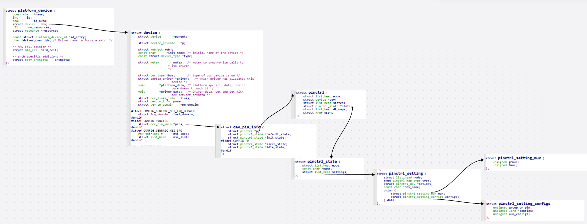

查看具体设备树中的宏定义

include/dt-bindings/gpio/gpio.h

include/dt-bindings/pinctrl/rockchip.h

dt-bindings/clock/rk3588-cru.h

查看物理单系统中的pinctrl配置，获取物理外设真实的device name

  cat /sys/kernel/debug/pinctrl/pinctrl-maps

pinctrl的三大作用,有助于理解相关结构体

1.引脚枚举与命名 enumerating and naming

2.引脚服用 Multiplexing：比如用作GPIO、I2C或其他功能

3.引脚配置 Configuration：比如上拉、下拉、open drain、驱动强度等

rk3588s.dtsi
rk3588s.-pinctrl.dtsi该文件枚举了3588所有的iomux实例

查看引脚的复用情况
cat /sys/kernel/debug/pinctrl/pinctrl-rockchip-pinctrl/pinmux-pins

RK3588频脚计算方式与一般的计算方式没有区别：
GPIO pin脚计算公式：pin = bank * 32 + number
GPIO 小组编号计算公式：number = group * 8 + X

摘自官网：

下面演示GPIO1_D0 pin脚计算方法：

bank = 1;      //GPIO1_D0 => 1, bank ∈ [0,4]

group = 3;      //GPIO1_D0 => 3, group ∈ {(A=0), (B=1), (C=2), (D=3)}

X = 0;       //GPIO1_D0 => 0, X ∈ [0,7]

number = group * 8 + X = 3 * 8 + 0 = 24

pin = bank*32 + number= 1 * 32 + 24 = 56;

GPIO1_D0 对应的设备树属性描述为:<&gpio1 24 GPIO_ACTIVE_HIGH>,由kernel-5.10/include/dt-bindings/pinctrl/rockchip.h的
的宏定义可知，也可以将GPIO1_D0描述为<&gpio1 RK_PD0 GPIO_ACTIVE_HIGH>。

## client端相关结构体

https://pixso.cn/app/board/2hWH9JSK6ESlVP76tmeENQ?showQuickFrame=true&icon_type=3&file_type=20 

