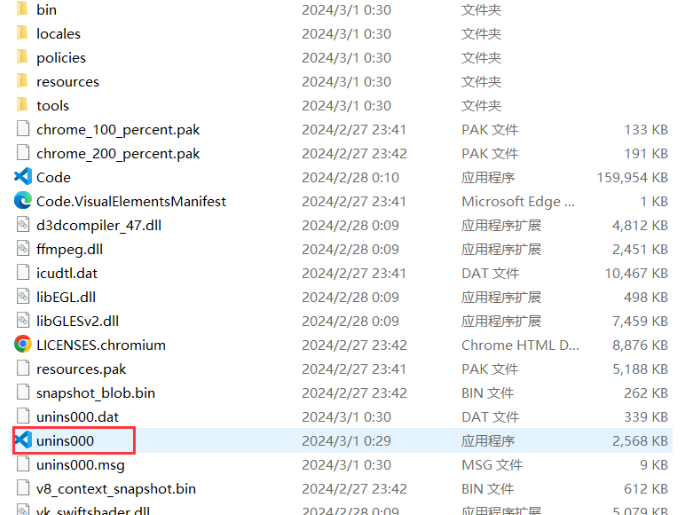

1.安装vscode


# 一、安装vscode

1.安装vscode

下载链接：https://code.visualstudio.com/Download#

2.安装VScode插件

https://marketplace.visualstudio.com

[Search results - remote | Visual Studio Code , Visual Studio Marketplace](https://marketplace.visualstudio.com/search?term=remote&target=VSCode&category=All categories&sortBy=Relevance)

安装vscode时选择默认路径，安装完成后打开，安装扩展：
1、 C/C++（就是有些教程里的cpptools）
2、 C/C++ Clang Command Adapter：提供静态检测（Lint），很重要
3、 Code Runner：右键即可编译运行单文件，很方便
4、 Bracket Pair Colorizer：彩虹花括号
5、 Include Autocomplete：提供头文件名字的补全
6、 C/C++ Snippets：Snippets 即重用代码块，
7、 One Dark Pro：大概是VS Code安装量最高的主题
8、 python
9、Clang-Format
10、Chinese （Simplified）Language Pack for Visual Studio Code：汉化包

# 二、卸载

1、打开控制面板的程序，卸载安装的vscode

或者

找到安装目录点击unins000



2.删除相关配置文件

```
C: \ Users \ .vscode
C: \ Users \ AppData \ Roaming \ Code 
```

或者

win+r输入以下内容

```c
%appdata%		#删除 Code目录
%userprofile%	#删除 .vscode
```


[彻底卸载VScode并重置本地配置数据-CSDN博客](https://blog.csdn.net/2301_80868127/article/details/136386915)

[vsCode离线安装remote-ssh插件搭建远程开发环境 (qq.com)](https://mp.weixin.qq.com/s/n7zyDFOeHd9K5oSKz7Zg9Q)
