# 一、环境准备

win11、小爱音箱、esp32(通过wol唤醒电脑)、巴法云平台注册

这里使用的是esp32-cam

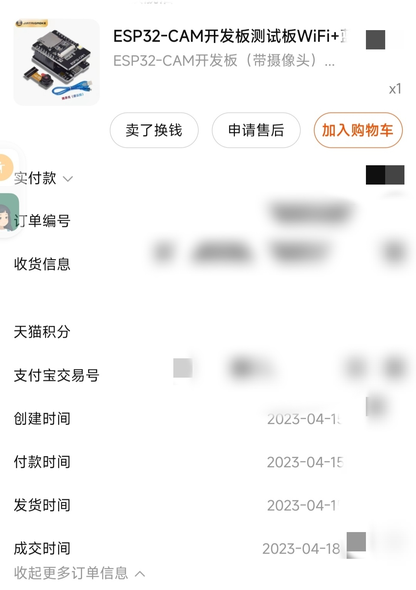

# 二、开关机原理

开机利用WOL技术，Wake-On-LAN简称WOL，是一种电源管理功能；如果存在网络活动，则允许设备将操作系统从待机或休眠模式中唤醒。许多主板厂商支持IBM提出的网络唤醒标准。该标准允许网络管理员远程打开PC机电源,以便进行文件升级、资源跟踪和设备清点等工作。WOL在还未广泛的采用,但在网络时代却具有广阔的发展前景。Wake-On-LAN的实现，主要是向目标主机发送特殊格式的数据包，是AMD公司制作的MagicPacket这套软件以生成网络唤醒所需要的特殊数据包，俗称魔术包（Magic Packet）。MagicPacket格式虽然只是AMD公司开发推广的技术，并非世界公认的标准，但是仍然受到很多网卡制造商的支持，因此许多具有网络唤醒功能的网卡都能与之兼容。wol基本实现原理实现是向需要被唤醒的终端网卡发送`FFFFFFFFFFFFFF+目标主机MAC地址(重复16次)`所组成的一个数据包，网卡收到数据后终端。（需要主板支持WOL，在BIOS中设置打开）

wol参考：https://blog.csdn.net/a18359388932/article/details/126949062

关机则通过获取巴法云获取关机指令，再通过python执行关机命令实现。

## 数据传输框架

小爱其实是不直接操作内网被控的电脑，而是通过小爱给一个第三方物联网平台巴法云发送一个消息，而你内网要部署一个用来接收巴法云下发的消息的程序，一旦接收到状态有发生变化，就执行一些执行，比如发送魔术包开机，再比如通过脚本ssh登录你的主机Windows主机执行关机命令.

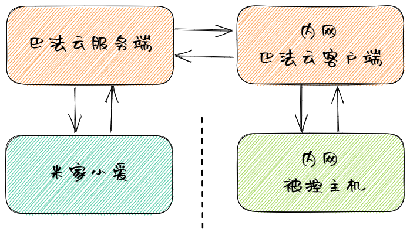

# 三、环境搭建

## 1.巴法云平台设置

打开巴法科技&巴法云-巴法设备云-巴法物联网云平台 (bemfa.com)，点击注册

TCP创客云-》新建主题 pc006 -》设置昵称为电脑

注意：

新建主题的名称`pc`可以任意修改，但末尾必须是006，表示开关设备

修改设备昵称，这个昵称`电脑`就是后面在米家中控制的名称

记住私钥、主题（`pc006`）后续会用到

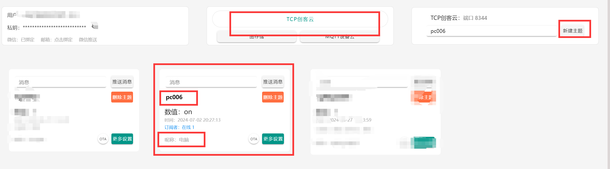

## 2.米家设置

打开手机app`米家`-我的-添加其他平台-添加-选择巴法-登录巴法账号-同步设备；

同步成功后会显示出电脑图标，后面就可以通过小爱同学语音控制"打开电脑"

## 3.windows网络唤醒设置

进入BIOS设置wol（自行百度设置）

1.打开设备管理器，点击网络适配器，右键属性，将电源管理的两个勾勾打上；

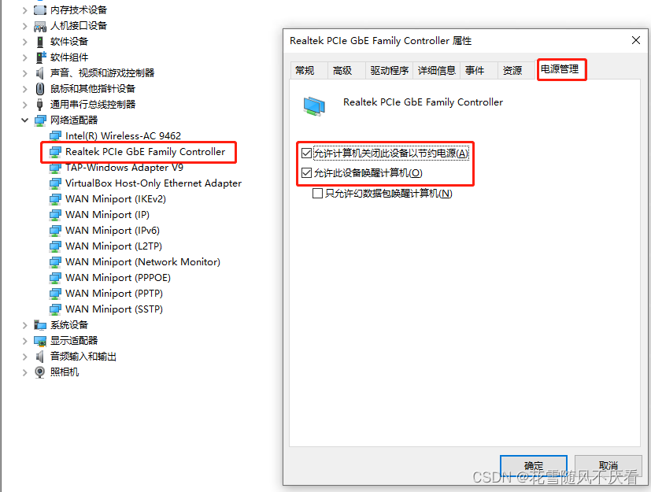

在高级设置里面将关机网络唤醒和魔术封包唤醒开启

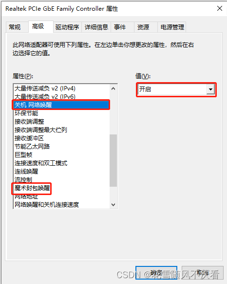

## 4.搭建esp32开发环境并部署

参考：

https://blog.csdn.net/weixin_43935402/article/details/125590294

环境搭建完毕后：

本项目使用 Arduino 框架。

- WakeOnLan : https://github.com/a7md0/WakeOnLan
- AsyncTCP : https://github.com/me-no-dev/AsyncTCP

参考：

https://github.com/yeyt97/ESP32-Bemfa-WOL-Tool/tree/main

## （1）新建项目

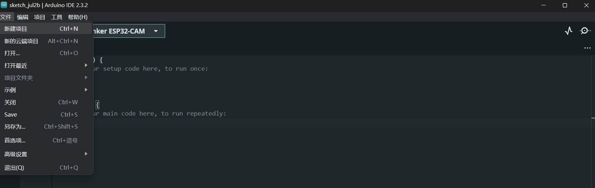

## （2）导入esp32库

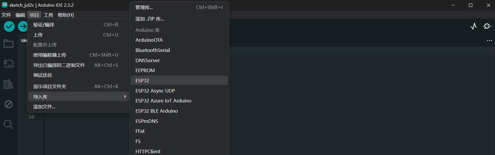

## （3） 添加库

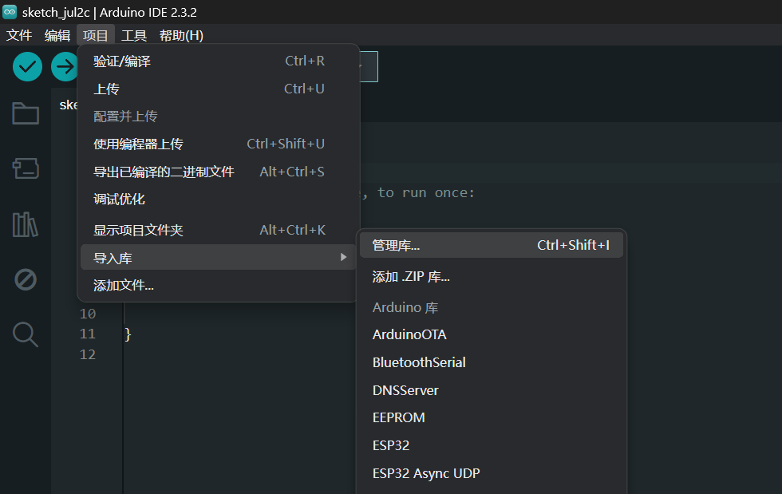

添加库WakeOnLan 

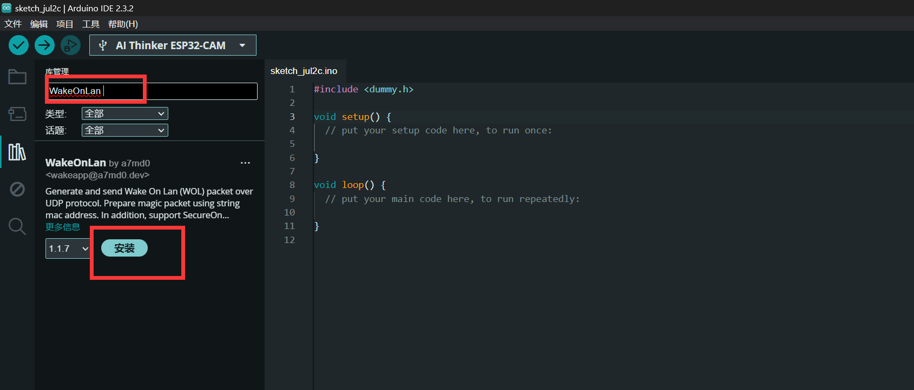

添加库AsyncTCP 

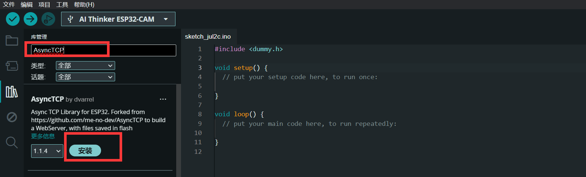

## （4）导入库

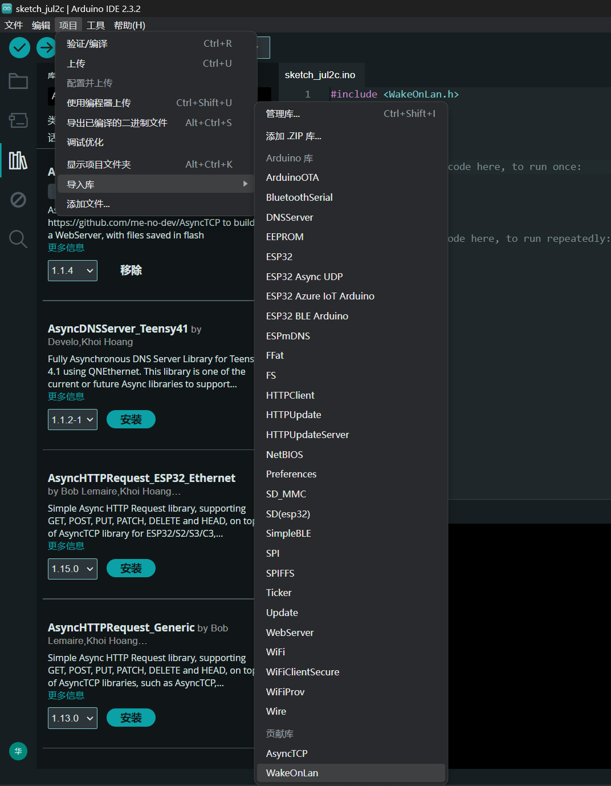

添加文件bemfa_client.hpp、wifi_helper.hpp：

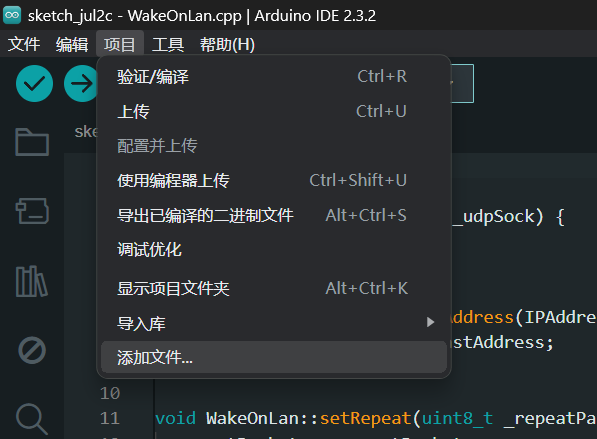

将main.cpp拷贝到.ino文件中

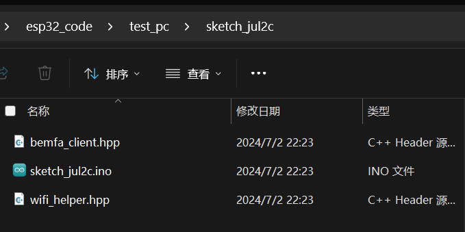


```
#include "bemfa_client.hpp"
#include "WakeOnLan.h"
#include "wifi_helper.hpp"

BemfaClient* bemfaClient;
WifiHelper* wifiHelper;

WiFiUDP UDP;
WakeOnLan WOL(UDP);

const int LED_Pin = 2;

const char *SSID = "xxx";  // wifi名称
const char *PSW = "xxx";  // wifi密码

const char *UID = "xxx";  // 巴法云的UID
const char *TOPIC = "pc006";  // 巴法云中创建的TOPIC(不是昵称)

const char *TARGET_MAC_ADDR = "xxx";  // 要启动的电脑的MAC地址

void blinkTwice() {
    digitalWrite(LED_Pin, HIGH);
    delay(200);
    digitalWrite(LED_Pin, LOW);
    delay(200);
    digitalWrite(LED_Pin, HIGH);
    delay(200);
    digitalWrite(LED_Pin, LOW);
}

void setup() {
    Serial.begin(115200);
    Serial.println("Beginning...");
    wifiHelper = new WifiHelper(SSID, PSW, LED_Pin);
    bemfaClient = new BemfaClient(UID, TOPIC);
    bemfaClient->addCommand("on", []{
        Serial.println("Send magic packet");
        WOL.setRepeat(3, 100);
        WOL.calculateBroadcastAddress(WiFi.localIP(), WiFi.subnetMask());
        WOL.sendMagicPacket(TARGET_MAC_ADDR);
        blinkTwice();
    });
}

void loop() {
    wifiHelper->tick();
    bemfaClient->tick();
}
```

编译烧录即可，然后通过小爱同学“打开电脑”即可控制电脑开机

## 5.关机python脚本配置

安装python

参考：https://docs.python.org/zh-cn/3/using/index.html

```
#安装相关依赖
pip install requests
pip install schedule
pip install pyinstaller
```

python打包
https://www.cnblogs.com/weilaiqinkong/p/17240065.html

如：pyinstaller -F -w main.py

巴法云平台tcp连接参考：https://bbs.bemfa.com/81

### main.py

```

# -*- coding: utf-8
import socket
import threading
import time
import os
import shutil
import sys
import getpass

def connTCP():
    global tcp_client_socket
    # 创建socket
    tcp_client_socket = socket.socket(socket.AF_INET, socket.SOCK_STREAM)
    # IP 和端口
    server_ip = 'bemfa.com'
    server_port = 8344
    try:
        # 连接服务器
        tcp_client_socket.connect((server_ip, server_port))
        #发送订阅指令
        substr = 'cmd=1&uid=巴法云私钥&topic=pc006\r\n'
        tcp_client_socket.send(substr.encode("utf-8"))
    except:
        time.sleep(2)
        connTCP()

#心跳
def Ping():
    # 发送心跳
    try:
        keeplive = 'ping\r\n'
        tcp_client_socket.send(keeplive.encode("utf-8"))
    except:
        time.sleep(2)
        connTCP()
    #开启定时，30秒发送一次心跳
    t = threading.Timer(30,Ping)
    t.start()


connTCP()
Ping()

while True:
    # 接收服务器发送过来的数据
    recvData = tcp_client_socket.recv(1024)
    if len(recvData) != 0:
        data = recvData.decode('utf-8')
        print('recv:', data)
        if "on" in data:
            print("do nothing!")
        elif "off" in data:
            print("starting poweroff after 3s ...")
            # 3s后 系统自动关机
            print(os.system('shutdown -s -t 3'))
    else:
        print("conn err")
        connTCP()

```

设置main.exe开机启动

https://www.cnblogs.com/muxiaomu/p/16649990.html