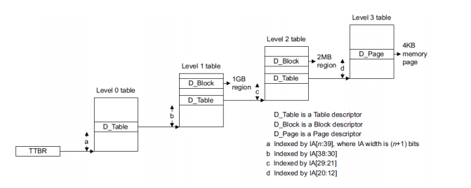
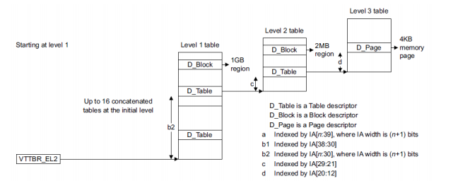

ARM64为支持内存虚拟化，可以将地址类型分为如下三种：

- **VA（虚拟地址）**

   最大宽度为48bit，VA地址空间可分为底部VA和顶部VA两个子区域，每个VM子区域最大支持256T
   底部VA：0x0000_0000_0000_0000 =>0x0000_FFFF_FFFF_FFFF
   顶部VA：0xFFFF_0000_0000_0000 =>0xFFFF_FFFF_FFFF_FFFF

- **IPA（中间物理地址）**

   如果不支持Stage 2转换，那么IPA==PA。如果支持Stage 2，IPA作为Stage 1的OA(Output Adress)，IPA作为Stage 2的IA(Input Adress)。它最大支持48bit。

- **PA（物理地址）**

   物理内存单元映射中地址，可以看做是PE到内存系统的输出地址(OA)，其最大支持48bit。

 上图是ARM64内存虚拟化的框图，虚拟机通过TTBRn_EL1完成Stage 1的地址转换，将虚拟机使用的VA转换成IPA。然后再通过VTTBR_EL2完成Stage 2的地址转换，将IPA转换成PA。

上图是Stage 1（一阶地址转换图）图解，其转换过程如下：

| TTBR 寄存器提供Level 0查找的基地址，通过此基地址和IA[n:39] => 查找到Level 1基地址 |
| ------------------------------------------------------------ |
| Level 1基地址结合IA[38：30]=> 查找到Level2 的基地址          |
| Level 2基地址结合IA[29：21]=> 查找到Level3 的基地址          |
| Level 3基地址结合IA[20：12]=> 查找物理页框所在地址OA         |
| 最后得到需要的物理地址PA[47：0] <= OA[47:12] + IA[11：0]     |

 上图是Stage 2（二阶地址转换图）图解，，其转换过程如下：

| Stage 2有级联table的概念，可以减少level的级数                |
| ------------------------------------------------------------ |
| 所谓级联就是假如有IA[40:0]，而Level1解析地址段为IA[38:30]，超过了2个bit，而2^40 = 2^2*2^38，所以相当于要2^2个这样的translation table来实现级联解析。ARMv8规定，Stage 2最多支持4-bit级联，也就是最大级联2^4 == 16个translation table级联解析.以达到减少查找level的目的. |
| VTTBR_EL2寄存器提供初始Level查找基地址，Stage 2只为EL2服务   |
| 同Stage 1，Level 1支持1GB的内存block，Level 2支持2MB的内存block |
