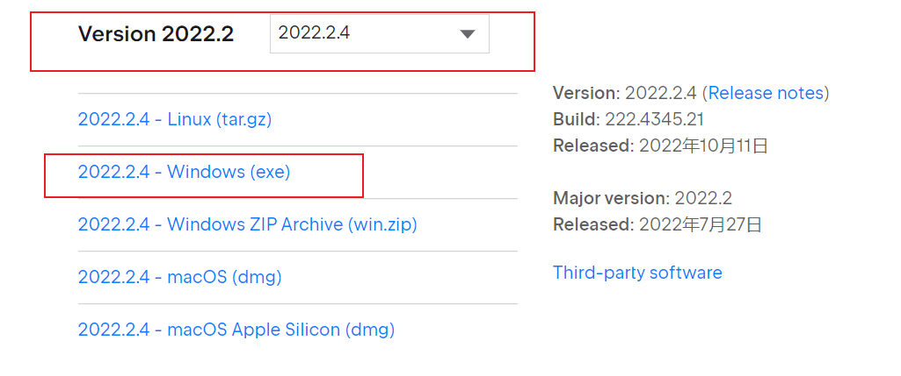
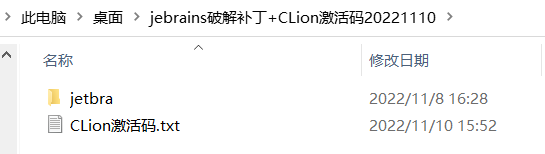
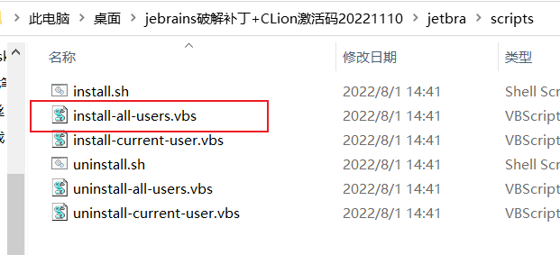
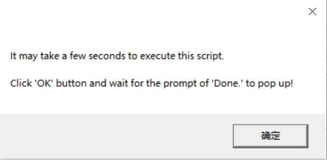
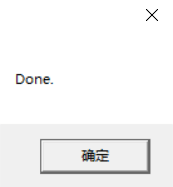
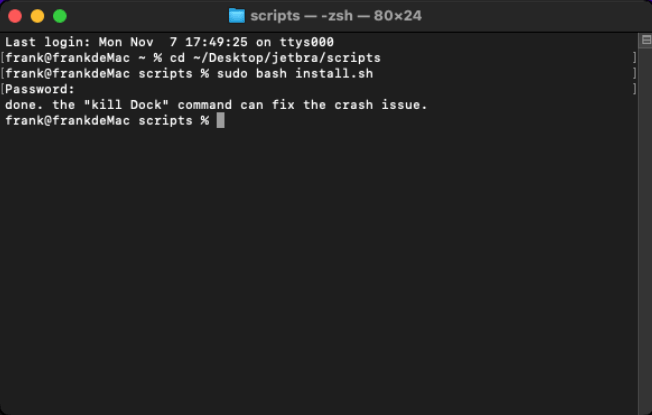
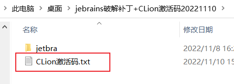
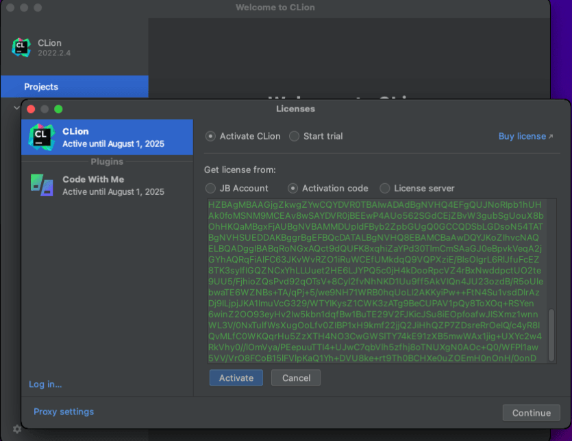
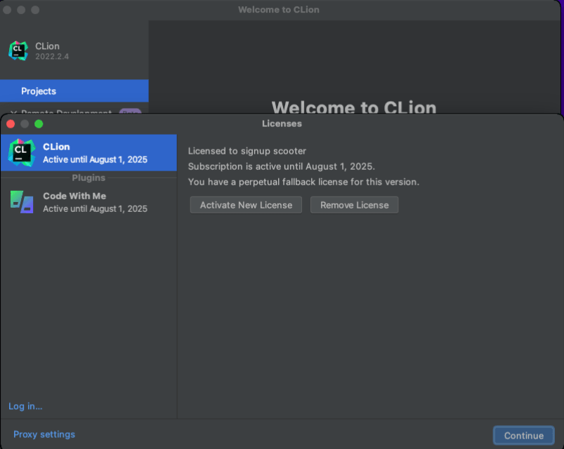

## 下载与安装

此教程为CLion 2022.2.4 破解教程，且此教程以及下面提供的破解补丁适用与2022.2以后的新版本。
2022年11月10日亲测有效，mac与windows均测试完美破解

### CLion 下载

Clion官网下载地址：https://www.jetbrains.com.cn/clion/download/other.html



找到2022.2.4的，然后根据自己的电脑系统选择。Windows的下载Windows，Mac的下载Mac的。

### 安装

直接上面的地址下载安装即可，安装完后记得不要打开，打开后也要先关闭，这里步骤就忽略了，安装很简单。

- **卸载老版本 CLion(未安装则不用管，跳过看下面步骤)**
  注意，安装新版本之前，如果本机安装过老版本的, 需要先彻底卸载，以免两者冲突，导致破解失败。
  **安装太简单了，步骤就忽略了。**

## 破解

### 破解补丁下载

破解补丁下载地址：https://kohler.lanzouo.com/iS5E40n7ojba

### Windows版破解

下载破解补丁后，解压得到，如下图：



将上面图示的补丁的所属文件夹 `/jetbra` 复制电脑某个位置，我是放置到了 桌面目录下（不推荐，自己选个D盘目录或者其他位置），
点击进入`/jetbra` 补丁目录，再点击进入`/scripts` 文件夹，双击执行 `install-all-user.vbs` 破解脚本：



**注意：如果执行脚本被安全软件提示有风险拦截，允许执行即可。**



会提示安装补丁需要等待数秒。点击**【确定】**按钮后，过程大概 10 - 30 秒，如看到弹框提示 Done 时，表示激活破解成功：



### mac版破解

**Mac / Linux** 系统与上面 Windows 系统一样，需将补丁所属文件`/jetbra` 复制到某个路径，且**路径不能包含空格与中文**。

之后，打开终端，进入到`/jetbra/scripts` 文件夹， 执行 `install.sh`脚本, 命令如下：


```shell
sudo bash install.sh
```

看到提示 Done , 表示激活成功。



**Mac / Linux** 用户执行脚本后，脚本会自动在当期用户环境变量文件中添加了相关参数文件，**Mac / Linux 需重启系统**，以确保环境变量生效。

### linux版破解

和mac版一样，参考mac,这里就不做介绍了。

### 重启 CLion

**脚本执行成功后，一定要重启 CLion**!!!

**脚本执行成功后，一定要重启 CLion**!!!

**脚本执行成功后，一定要重启 CLion**!!!

## 填入指定激活码完成激活

打开文件夹里的激活码，粘贴到输入框内，点击 `Activate` 按钮，就激活成功了。





激活成功后，就可以开心的 coding 了 ~



转：

[CLion 2022.2.4破解教程详细图解mac,windows,linux均适用 - 愚生浅末 - 博客园 (cnblogs.com)](https://www.cnblogs.com/kohler21/p/17111018.html)

参考：

[使用Clion优雅的完全远程自动同步和远程调试c++-腾讯云开发者社区-腾讯云 (tencent.com)](https://cloud.tencent.com/developer/article/1406250)
