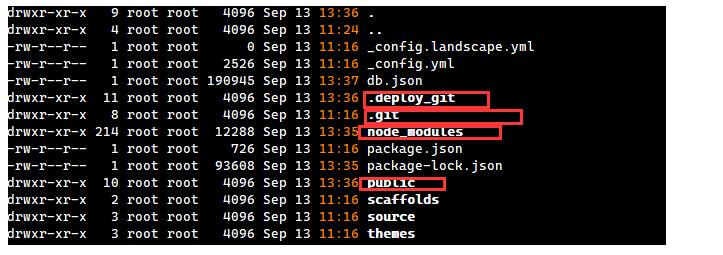
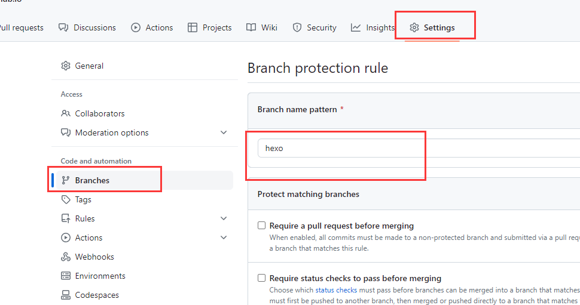
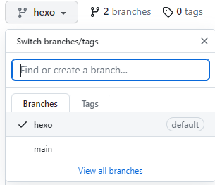
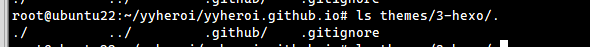
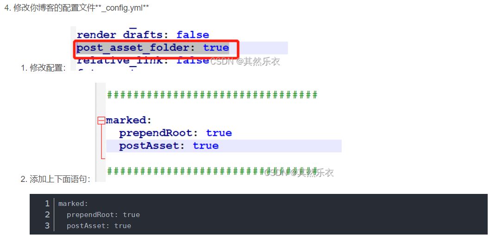
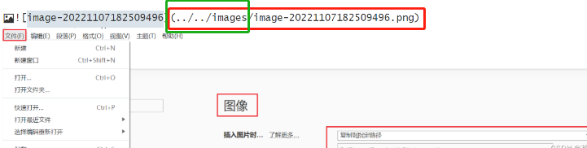

[toc]


# 1.博客搭建

https://yyheroi.github.io/2023/08/25/github+hexo%E5%8D%9A%E5%AE%A2%E6%90%AD%E5%BB%BA/

# 2.创建一个新文件夹new，用于上传hexo博客目录

将以下目录（除了红色方框的目录）拷贝到新目录中



参考：https://blog.csdn.net/K1052176873/article/details/122879462 

# 3.github上创建hexo分支并设置为默认分支

## 创建hexo分支



## 将hexo分支设置为默认分支



# 4.进入新建的文件夹中git clone，再上传相关文件至hexo分支

基本原理：github仓库开两个分支，main分支存放的是hexo生成的静态页面，hexo分支存放基本的 Hexo 博客项目的结构和默认配置文件，如文章，主题
当需要重新搭建环境时，直接拉取hexo分支中Hexo博客目录以及相关配置文件，当需要更新博客时直接

```
cd new
git clone git@github.com:<username>/<username>.github.io.git #<username> 用户名
git branch    #查看分支，显示 * hexo
```


## 1.clone下来的文件夹内应该有个.gitignore文件，用来忽略一些不需要的文件，表示这些类型文件不需要git。如果没有，右键新建，内容如下：

```
.DS_Store
Thumbs.db
db.json
*.log
node_modules/
public/
.deploy*/
```

## 2.如果已经clone过主题文件，那么需要把theme主题文件夹里的 .git 也删除，我这里已经删除了theme主题的.git目录



## 3.送new目录中的相关文件到远程仓库 hexo分支

```
git add .
git commit –m add_branch
git push        

```


# 5.！新环境中快速搭建博客环境！

## 1.设置ssh

参考：https://docs.github.com/en/authentication/connecting-to-github-with-ssh/generating-a-new-ssh-key-and-adding-it-to-the-ssh-agent

```
ssh-keygen -t ed25519 -C "your_email@gmail.com"
cat ~/.ssh/id_ed25519.pub  #将里面的内容复制到 github ->settings ->SSH and GPC keys ->SSH keys ->New SSH key中
ssh -T git@github.com  #输入yes之后，行末尾会显示你的用户名（绑定成功邮箱会收到邮件提醒）
#接着在本地绑定与Github的用户名和邮箱（git）
git config --global user.name "<username>"    #自己的用户名
git config --global user.email 'xxx@xxx.com'  #自己的邮箱
```

## 2.安装nodejs和hexo

```
sudo apt update
sudo apt-get install git

sudo apt install nodejs
sudo apt install npm  
```

## 3.拉取hexo博客目录

```
git clone git@github.com:<username>/<username>.github.io.git #<username> 用户名
git branch    #查看分支，显示 * hexo
npm install hexo
npm install
npm install hexo-deployer-git        #不需要hexo init这条指令
npm i hexo-renderer-marked


#更新博客 添加新文章 hello-world
hexo new "hello-world"
git add .        #将文章备份至 hexo分支  或者git add source/_posts/hello-world 
git commit –m "hello-world"
git push         #或者git push origin hexo

hexo g        #生成静态页面
hexo s        #启动本地服务器 预览
hexo d        #将生成的博客文件部署到 github main分支，Hexo博客项目配置文件中_config.yml已设置好
```

# 6.遇到的问题

## 问题1.nodejs版本过低

npm WARN notsup Unsupported engine for hexo@6.3.0: wanted: {"node":">=12.13.0"} (current: {"node":"10.19.0","npm":"6.14.4"})
npm WARN notsup Not compatible with your version of node/npm: hexo@6.3.0
npm WARN notsup Unsupported engine for hexo-front-matter@3.0.0: wanted: {"node":">=12.13.0"} (current: {"node":"10.19.0","npm":"6.14.4"})
npm WARN notsup Not compatible with your version of node/npm: hexo-front-matter@3.0.0
npm WARN notsup Unsupported engine for hexo-cli@4.3.1: wanted: {"node":">=14"} (current: {"node":"10.19.0","npm":"6.14.4"})
npm WARN notsup Not compatible with your version of node/npm: hexo-cli@4.3.1
npm WARN notsup Unsupported engine for hexo-log@3.2.0: wanted: {"node":">=12.4.0"} (current: {"node":"10.19.0","npm":"6.14.4"})
npm WARN notsup Not compatible with your version of node/npm: hexo-log@3.2.0
npm WARN notsup Unsupported engine for abbrev@2.0.0: wanted: {"node":"^14.17.0 || ^16.13.0 || >=18.0.0"} (current: {"node":"10.19.0","npm":"6.14.4"})
npm WARN notsup Not compatible with your version of node/npm: abbrev@2.0.0
npm WARN notsup Unsupported engine for hexo-fs@4.1.1: wanted: {"node":">=14"} (current: {"node":"10.19.0","npm":"6.14.4"})
npm WARN notsup Not compatible with your version of node/npm: hexo-fs@4.1.1
npm WARN notsup Unsupported engine for hexo-log@4.1.0: wanted: {"node":">=14"} (current: {"node":"10.19.0","npm":"6.14.4"})
npm WARN notsup Not compatible with your version of node/npm: hexo-log@4.1.0
npm WARN optional SKIPPING OPTIONAL DEPENDENCY: fsevents@2.3.3 (node_modules/fsevents):
npm WARN notsup SKIPPING OPTIONAL DEPENDENCY: Unsupported platform for fsevents@2.3.3: wanted {"os":"darwin","arch":"any"} (current: {"os":"linux","arch":"x64"})

## 升级nodejs

```
wget -qO- https://raw.githubusercontent.com/nvm-sh/nvm/v0.38.0/install.sh | bash         #安装 nvm
source ~/.bashrc            #加载 nvm
nvm install node            #使用 nvm 安装最新版本的 Node.js
node -v                     #验证 Node.js 版本
```


## 问题2.hexo博客图片不显示

https://blog.csdn.net/QRLYLETITBE/article/details/127737904 

```
npm i hexo-renderer-marked

```

## 新建imgs文件夹



```
marked:
  prependRoot: true
  postAsset: true

```
## 修改图片路径


