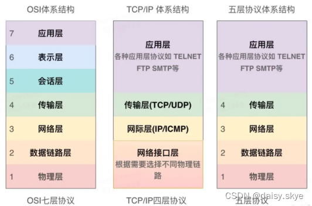

# PHY（physical Layer，PHY）

## 什么是PHY？

物理层芯片称为PHY、数据链路层芯片称为MAC

可以看到PHY的数据是[RJ45](https://so.csdn.net/so/search?q=RJ45&spm=1001.2101.3001.7020)网络接口（网线口）穿过了的差分信号，而PHY作用就是将差分信号转为数字信号，这块内容不用深究，制造商都设计好了。

那我们干什么呢？（主要是对phy芯片进行模式选择，比如工作速率，工作模式）

## 什么是RJ45接口？

RJ45接口通常用于数据传输，最常见的应用为网卡接口。RJ-45端口是我们最常见的端口之一，是比较常见的[双绞线](https://www.zhihu.com/search?q=双绞线&search_source=Entity&hybrid_search_source=Entity&hybrid_search_extra={"sourceType"%3A"answer"%2C"sourceId"%3A3477234795})以太网端口，因为在快速以太网中也主要采用双绞线作为传输介质。

RJ45型网线插头又称水晶头，共由八芯做成，广泛应用于局域网和ADSL宽带上网用户的网络设备间网线（称作五类线或双绞线）的连接。

RJ45接头根据线的排序不同主要分两种，一种是橙白、橙、绿白、蓝、蓝白、绿、棕白、棕；另一种是绿白、绿、橙白、蓝、蓝白、橙、棕白、棕；因此使用RJ45接头的线也有两种即：直通线、交叉线。分别称作[T568A线序](https://www.zhihu.com/search?q=T568A线序&search_source=Entity&hybrid_search_source=Entity&hybrid_search_extra={"sourceType"%3A"answer"%2C"sourceId"%3A3477234795})和T568B线序。

RJ45插座连接器接口内部是金属，注意不能受潮或者接触到水，否则会造成短路现象。

## 为什么要熟悉RJ45网口

上面说到针对phy芯片我们只要进行模式选择（下文会介绍使用[mdio](https://so.csdn.net/so/search?q=mdio&spm=1001.2101.3001.7020)接口，通过寄存器控制）

那模式选择后，如何查看是否有效呢？最简单直接的就是通过RJ45网口的指示灯查看

RJ45 座子上一般有两个灯，一个黄色(橙色)，一个绿色，**绿色亮的话表示网络连接正常，黄色闪烁的话说明当前正在进行网络通信**，**黄灯闪动频率快表示网速**好，这两个灯由 PHY 芯片控制。

## 网络七层协议

## 两个模块进行通信

下图是两个主控直接的通信，比如我们的电脑 和 路由器 ，但是如果没有中间的介质还能连接网络吗？答案是可以的

如果phy芯片没有，那么可以直接通过两个mac连接进行通信，之所以需要mac 、phy、变压器的目的是为了转换数据类型适配所以的网线，但是在一些电路上，没必要加这么多东西

比如搭载 Linux系统的arm芯片想要网络，可以直接通过mac和网卡芯片连接获取，这时候就需要通过RGMII接口或者MII接口 和 MDIO 连接网卡芯片。

（网卡芯片内置也是mac+phy，有的只有mac 层这个要看具体的手册）

## 什么是MDIO协议

mido协议即SMI协议

SMI协议也是一种通信协议类似与I2C协议但是通信方式不一样

SMI包含两根信号线，一个MDC时钟线，一个MDIO双向传输的数据线，

如图为SMI应用框图。STA设备通过MDIO接口与PHY通信。STA（StaTIon Management）为主控设备，比如MCU、MAC、ONU等。PHY为从设备。一个STA最多管理32个PHY。MDC信号由STA控制，MDIO信号根据通信方式的不同可以由STA或者PHY接管控制。如图通常MDIO会接一个电阻上拉至接口电源。

## MDIO的作用 

从上面的连接图可以看到MDIO是用来连接主设备和多个PHY设备，并且通过MDIO来传输数据

那么传输的是数据是哪些呢？主要是传输链接状态、传输速度与选择、断电、低功率[休眠状态](https://baike.baidu.com/item/休眠状态?fromModule=lemma_inlink)、TX/RX模式选择、[自动协商](https://baike.baidu.com/item/自动协商/7765053?fromModule=lemma_inlink)控制、环回模式控制等。

### MDIO没那么重要

MDIO在上面说到的两个模块通信，我提到了 arm芯片和网卡芯片直接需要，那么这个真的有必要吗？其实没必要连接！！！

换个话说 不连接也可以使得网络畅通，因为网络的数据传输时靠RGMII不是靠MDIO，MDIO的作用仅仅只是用来查看一些状态和功能，还有简单的控制，而这些简单的控制是完全可以有网卡芯片内置去写死，arm层只要和网卡的写的一直就可以通讯。

但是为什么很多时候需要通过mdio来进行读写控制，这个只是在网络通讯正常后的升级优化，用来方便查看状态，就像写了个前端网页来看后台数据。

如果mido没有读通，或者读取的数据是0xfffff，那么不一定是mdio的问题，很多时候是网卡本身没有启动！

## MDIO读写时序

Preamble：32bits的前导码

Start：2bit的开始位。

OP Code：2bits的操作码，10表示读，01表示写。

PHYAD：5bits的PHY地址。

REGAD：5bits的寄存器地址，即要读或写的寄存器。

Turn Around：2bits的TA，在读命令中，MDIO在此时由MAC驱动改为PHY驱动，并等待一个时钟周期准备发送数据。在写命令中，不需要MDIO方向发生变化，则只是等待两个时钟周期准备写入数据。

Data：16bits数据，在读命令中，PHY芯片将读到的对应PHYAD的REGAD寄存器的数据写到Data中，在写命令中，MAC将要写入对应PHYAD的REGAD寄存器的值写入Data中。

Idle：空闲状态，此时MDIO无源驱动，处高阻状态，但一般用上拉电阻使其处在高电平，上拉电阻一般为1.5K。
为什么说读取的phy最多32个
因为mdio中读取的phy只提供5bit的字节即最高11111 转成十进制就是31即0-31就是32个，但这是从读取的方式判断的，而mdio读取是依照phy芯片本身地址空间就5为

## 为什么说reg地址最多32个

同样mdio中读取的reg只提供5bit的字节即最高11111 转成十进制就是31即0-31就是32个

 PHY 芯片寄存器地址空间为 5 位，地址 0-31 共 32 个寄存器， IEEE 定义了 0-15 这 16 个寄存器的功能， 16~31 这 16 个寄存器由厂商自行实现。 也就是说不管你用的哪个厂家的 PHY 芯片，其中 0~15 这 16 个寄存器是一模一样的。 仅靠这 16 个寄存器是完全可以驱动起 PHY 芯片的，至少能保证基本的网络数据通信。

 

转：

[PHY芯片快速深度理解（持续更新中……）-CSDN博客](https://blog.csdn.net/qq_40715266/article/details/124095801)

[PHY（Physical Layer，PHY） - 知乎 (zhihu.com)](https://zhuanlan.zhihu.com/p/148538791)
