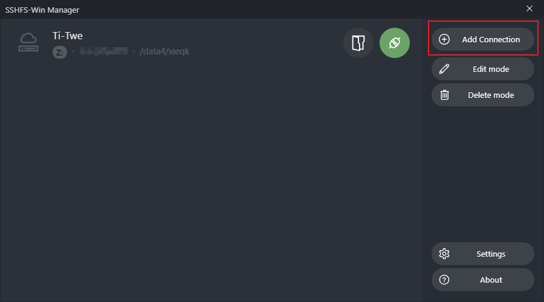
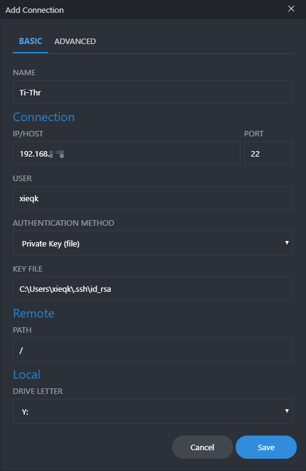
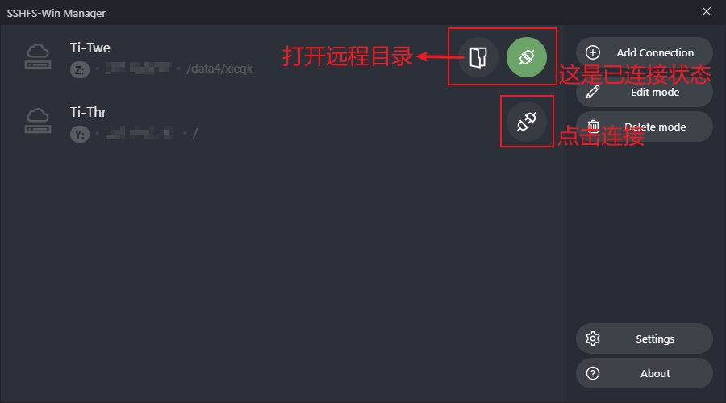
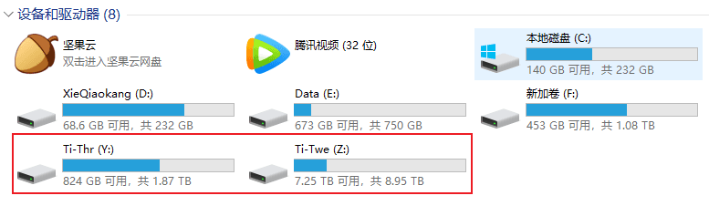
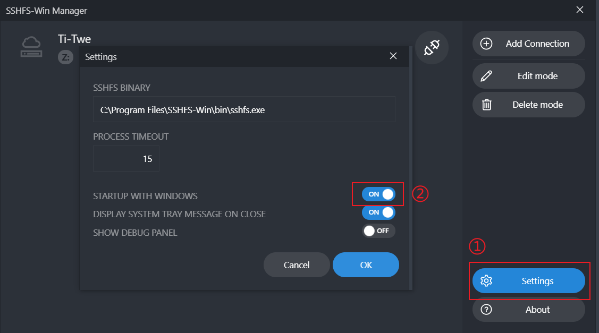
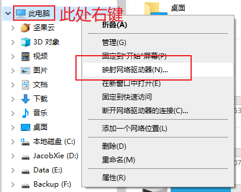
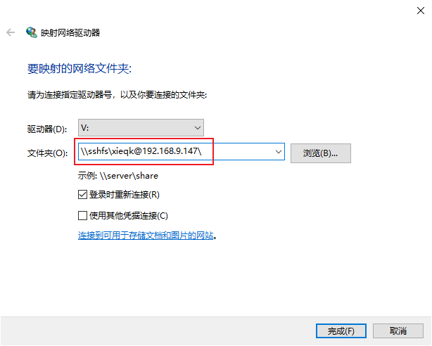
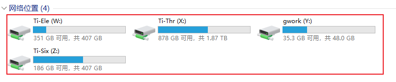

### 下载

直接前往 github 对应项目的 release 中下载最新版本即可，需注意 sshfs-win 对 winfsp 的最低版本依赖（下载最新版本一般即可满足），另外有GUI（用户图形操作界面）可供下载，建议下载。

- sshfs-win：https://github.com/billziss-gh/sshfs-win/releases
- winfsp：https://github.com/billziss-gh/winfsp/releases
- SSHFS-Win Manager：https://github.com/evsar3/sshfs-win-manager/releases (GUI，可选)

### 快速使用

可使用GUI图形界面（方式A），亦可手动挂载（方式B），建议使用GUI图形界面。

#### 方式A：使用GUI（推荐）

新建连接

安装好上述3个软件后，打开 GUI 界面如下，点击 `Add Connection`：



SSHFS-Win Manager GUI 主界面

依次填写每一项内容：

- NAME：给远程服务器取个名字
- Connection：远程服务器配置，如IP、端口、远程用户名、验证方式（密码，或密钥[参考：[SSH密钥管理及免密码登陆](https://blog.xieqk.com/posts/3517905979.html)]）
- Remote：远程目录配置，挂载后将成为本地对应盘符的根目录
- Local：本地盘符设置（注意不要与现有盘符冲突）

示例如下：



添加连接

点击 `Save` 保存。

挂在远程目录

在主界面中点击`连接`按钮，即可将远程目录挂在到本地：



添加新连接后的主界面

此时远程目录已经出现在了本地资源管理器中，未出现可刷新一下，或直接点击GUI主界面`连接`按钮左边的`打开文件夹`按钮即可进入目录。



本地挂载成功

长期使用建议在主界面的设置中打开`开机自启`：

打开开机启动




#### 方式B：手动挂载

挂载路径

**1. SSH 使用默认端口（22）**

此时，对应的 ssh 登陆命令为 `ssh username@remote_ip`，那么使用 sshfs-win 挂载远程服务器根目录和 home 目录的地址为：

```
# 根目录
\\sshfs.r\username@remote_ip\

# home 目录
\\sshfs\username@remote_ip\
# 或者 \\sshfs.r\username@remote_ip\home\username\
```

例如：`\\sshfs.r\xieqk@10.168.9.87\`，注意路径里面的分隔符为 windows 使用的反斜杠 `\`。

**2. SSH 使用其它端口（外网端口转发连接内网服务器）**

此时，ssh 登陆命令为 `ssh -p port username@remote_ip`，对应的 sshfs-win 挂载远程服务器根目录和 home 目录的地址在之前的 `remote_ip` 后加上 `!port` 即可：

```
# 根目录
\\sshfs.r\username@remote_ip\

# home 目录
\\sshfs\username@remote_ip\
# 或者 \\sshfs.r\username@remote_ip\home\username\
```

例如：`\\sshfs.r\xieqk@168.10.9.87!34567\`。

登陆挂载远程目录

将上述 `sshfs` 路径输入 windows 文件资源管理器地址栏，输入密码即可进入。（**注意：**弹窗中的账号显示的为 windows 的本地账号，不用修改。远程服务器的用户名已经包含在之前的 `sshfs` 路径之中，所以此处只需正常输入远程用户对应的密码即可。）

对于常用的远程目录，建议通过 `映射网络驱动器` 长期挂载于本地。



映射网络驱动器

在 `映射网络驱动器` 中，可自行分配驱动器盘号，然后在 `文件夹` 处输入上述 `sshfs` 路径，点击完成后在弹出的登录框处输入密码即可完成挂载。



输入 sshfs 路径

之后，可在 windows 文件浏览器的网络位置中看到已经挂载的所有远程目录：



本地挂载成功

详细参数（可跳过，需要时再查看）

sshfs-win 具体语法形式如下，其中 `[]` 中的内容为选填项，若为默认值可不填：

```
\\sshfs\[LOCUSER=]REMUSER@HOST[!PORT][\PATH]
\\sshfs.r\[LOCUSER=]REMUSER@HOST[!PORT][\PATH]
\\sshfs.k\[LOCUSER=]REMUSER@HOST[!PORT][\PATH]
```


- `REMUSER`: 即 remote user，指 SSH 登陆远程主机时的用户名。
- `HOST`：远程服务器，如 IP 地址，DNS 服务器名称 或 DNS 服务器 IP 地址
- `PORT`：SSH 登陆所使用的端口号 (选填，默认为 SSH(22) 端口).
- `PATH`：进入的远程服务器路径，可按照如下设置:
  - 前缀 `sshfs` 对应为 `HOST:~REMUSER/PATH`，即远程服务器上相对于该用户 `home` 目录的相对路径：`/home/remote_user/PATH`。
  - 前缀 `sshfs.r` 对应为 `HOST:/PATH` 即远程服务器上相对于根(root)目录的路径：`/PATH`。
  - 前缀 `sshfs.k` 与第一项相同，对应为 `HOST:~REMUSER/PATH`，但它使用 Windows 本地当前用户位于 `%USERPROFILE%/.ssh/id_rsa` 下的 SSH 密钥进行认证（需进行远程服务器配置，可参靠[SSH 密钥管理及免密码登陆](https://blog.xieqk.com/posts/3517905979.html)），不需要输入密码。（备注：使用前两项连接时，windows 也会提醒记住密码，所以只需要第一次输入密码并记住即可）
- `LOCUSER` windows本地用户名，可不填。


转：

https://blog.csdn.net/qq_31811537/article/details/124721621
