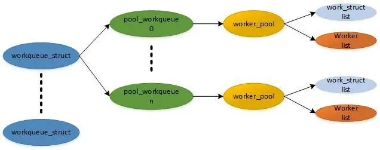

一、workqueue的作用及在Linux中断处理中的应用
1.1、workqueue的概述
Linux工作队列（Workqueue）是一个内核中的机制，它可以异步执行一些任务。在Linux内核中，当需要处理一些不是紧急的、需要后台执行的任务时，就会将这些任务加入到工作队列中，然后由内核计划适当的时间来执行这些任务。

工作队列的特点是异步执行，即任务的执行不会阻塞当前进程，而是交给后台线程进行处理。这种方式可以避免阻塞主线程，提高系统的响应速度和并发能力。

工作队列具有多种使用场景，比如定时器事件、网络I/O事件、驱动程序事件等，都可以通过工作队列来异步处理。

1.2、workqueue在Linux中断处理中的作用
workqueue是一种异步执行工作的机制，它可以在Linux中断处理中使用。当内核需要异步执行某些任务时，可以使用workqueue机制。

在Linux中断处理中，有些操作不能直接执行，因为它们可能会阻塞中断处理程序。例如，如果一个中断处理程序需要访问磁盘，那么它可能需要等待磁盘访问完成才能继续执行，这将导致中断处理程序的延迟和性能下降。为了避免这种情况，可以使用workqueue机制。

workqueue机制允许中断处理程序将任务提交给工作队列，在稍后的时间异步执行。这样，中断处理程序可以立即返回，并且不会阻塞其他中断处理程序的执行。工作队列是一组线程，它们可以同时执行多个任务。当工作队列中有任务时，内核会自动调度线程来执行任务。

workqueue机制是一种非常有效的机制，可以帮助内核异步执行任务，提高系统的性能和可靠性。


二、workqueue的实现原理
workqueue通过使用worker线程池来执行延迟性任务，能够提高系统的吞吐量和响应速度，适用于需要进行异步任务调度的场景。

workqueue是Linux系统中用于实现异步任务调度的机制，它允许驱动程序和内核线程安排延迟执行的工作。

workqueue由一个或多个worker线程池组成，每个worker线程都会不断地从workqueue中获取需要执行的工作项。
当驱动程序或内核模块需要执行一些延迟性的任务时，可以将这些任务封装成工作项（work）并添加到workqueue队列中。
worker线程在空闲时，从workqueue队列中取出一个工作项，并将其放入自己的私有队列中，等待执行。
一旦worker线程完成当前正在执行的工作项，就会从自己的私有队列中取出下一个工作项进行处理。
若workqueue队列中没有可用的工作项，则worker线程会等待直到有新的工作项被添加到队列中。
在workqueue中，还提供了几种不同的队列类型，如普通队列、高优先级队列和延迟队列等，以满足不同场景下的需求。
2.1、工作队列和工作者线程的关系
工作队列和工作者线程是相互依存的关系，它们通过协同工作来处理系统中的任务。

工作队列是一个先进先出的任务列表，其中包含需要被执行的任务。工作者线程则是实际执行这些任务的线程。当有新的任务添加到工作队列中时，工作者线程会自动从队列中取出任务并执行。

工作者线程通常是由内核创建的，其数量可以根据系统负载情况进行调整。当任务数量增加时，可以增加工作者线程的数量以加快任务处理速度。而当任务数量减少时，可以减少工作者线程的数量以节省系统资源。


2.2、工作队列的创建和销毁
在Linux内核中，工作队列通过struct workqueue_struct结构体来表示。创建和销毁工作队列通常通过以下函数：

创建工作队列：create_workqueue(const char *name); 该函数创建并返回一个指向工作队列的指针。参数name是工作队列的名称。
销毁工作队列：destroy_workqueue(struct workqueue_struct *wq); 该函数销毁由指针wq所表示的工作队列。
例如，创建和销毁一个名为“my_work”的工作队列：

工作队列的创建和销毁
在Linux内核中，工作队列通过struct workqueue_struct结构体来表示。创建和销毁工作队列通常通过以下函数：

创建工作队列：create_workqueue(const char *name); 该函数创建并返回一个指向工作队列的指针。参数name是工作队列的名称。
销毁工作队列：destroy_workqueue(struct workqueue_struct *wq); 该函数销毁由指针wq所表示的工作队列。
2.3、工作者线程的创建和销毁
Linux 内核中的工作者线程是一种特殊的内核线程，用于执行一些异步的、需要花费较长时间或者需要消耗大量 CPU 资源的任务。它们主要用于处理 I/O 操作、网络操作、文件系统缓存等等。

在 Linux 内核中，工作者线程的创建和销毁是由系统自动管理的。当进程请求创建一个工作者线程时，内核会检查当前是否有可用的空闲线程。如果没有，则会创建一个新的线程。当任务完成后，工作者线程会被回收并返回到线程池中，以备下次使用。

为了提高效率，Linux 内核还可以在运行时动态地调整线程池中工作者线程的数量。当系统负载较高时，内核会增加线程池中的线程数量，以处理更多的任务。当负载降低时，内核会减少线程池中的线程数量，以节省资源。

例如，展示如何在 Linux 内核中创建和销毁工作者线程：
```
#include <linux/module.h>
#include <linux/kernel.h>
#include <linux/workqueue.h>
#if 1
#define YYHDEBUG(fmt, ...) \
    printk(KERN_ERR "yyh debug [%s][%d] " fmt, __func__, __LINE__, ##__VA_ARGS__)
#else 
#define YYHDEBUG(debug)
#endif
static struct workqueue_struct *my_wq;

typedef struct {
    struct work_struct my_work;
    int x;
} my_work_t;

static void my_work_handler(struct work_struct *work)
{
    my_work_t *my_work = (my_work_t *)work;
    YYHDEBUG("my_work_handler: x=%d\n", my_work->x);
    kfree(my_work);
}

static int __init my_module_init(void)
{
    my_work_t *my_work;

    /* 创建工作者队列 */
    my_wq = create_workqueue("my_queue");
    if (!my_wq) {
        YYHDEBUG("create_workqueue failed!\n");
        return -1;
    }

    /* 创建并提交工作者线程 */
    my_work = (my_work_t *)kmalloc(sizeof(my_work_t), GFP_KERNEL);
    if (!my_work) {
        YYHDEBUG("kmalloc failed!\n");
        return -1;
    }
    INIT_WORK((struct work_struct *)my_work, my_work_handler);
    my_work->x = 1;
    queue_work(my_wq, (struct work_struct *)my_work);

    return 0;
}

static void __exit my_module_exit(void)
{
    /* 销毁工作者队列 */
    flush_workqueue(my_wq);
    destroy_workqueue(my_wq);
}

module_init(my_module_init);
module_exit(my_module_exit);

MODULE_LICENSE("GPL");
MODULE_AUTHOR("Lion Long");
MODULE_DESCRIPTION("A simple example Linux module.");
```

例子展示了如何创建一个名为“my_queue”的工作者队列，然后创建一个工作者线程来处理一个名为“my_work”的工作对象。“my_work_handler”函数将打印出传递给工作对象的参数“x”，并释放工作对象的内存。在模块初始化期间，创建工作者队列和工作对象，并提交工作对象到队列中。在模块退出期间，销毁工作者队列。

Linux 内核中的工作者线程是一种非常重要的机制，能够显著提高系统的性能和响应速度。虽然用户无法直接控制工作者线程的创建和销毁，但可以通过一些系统调优技巧来优化工作者线程的使用效果。
2.4、扩展知识：用户态线程的创建
线程创建：

```
#include <pthread.h>

int pthread_create(pthread_t *thread, const pthread_attr_t *attr,
                   void *(*start_routine)(void*), void *arg);
```

该函数用于创建一个新的线程，并将其添加到调用进程中。参数 thread 是指向新线程标识符的指针，参数 attr 是指向线程属性的指针（通常为 NULL），参数 start_routine 是指向线程执行函数的指针，参数 arg 是传递给线程执行函数的参数。

线程销毁：

```
void pthread_exit(void *value_ptr);
```

该函数用于终止当前线程，并返回一个指针值。这个值可以由其他线程通过 pthread_join 函数获取，也可以被忽略。

```
int pthread_join(pthread_t thread, void **value_ptr);
```


该函数用于阻塞当前线程，直到指定的线程 thread 终止。如果指针 value_ptr 不为 NULL，则会将线程的返回值存储在 value_ptr 指向的位置中。

注意：如果线程没有被显式地分离，则它将一直存在于内存中，直到进程结束。因此，在创建线程时，应该考虑是否需要将它们分离或者等待它们的结束。


原文链接：https://blog.csdn.net/Long_xu/article/details/1314057422.2
