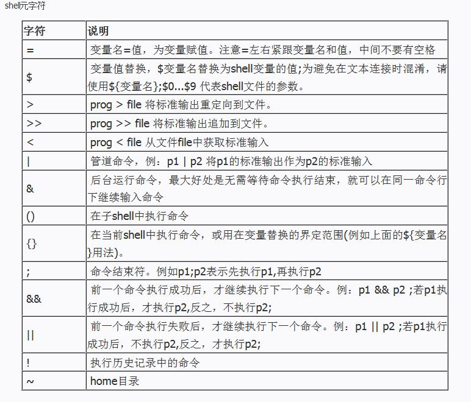
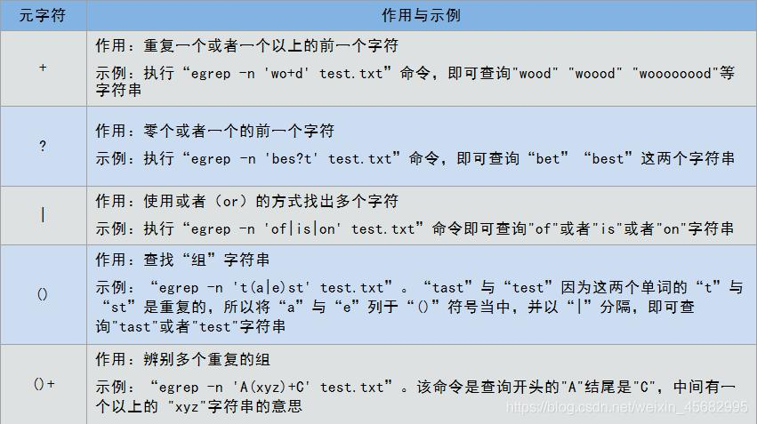
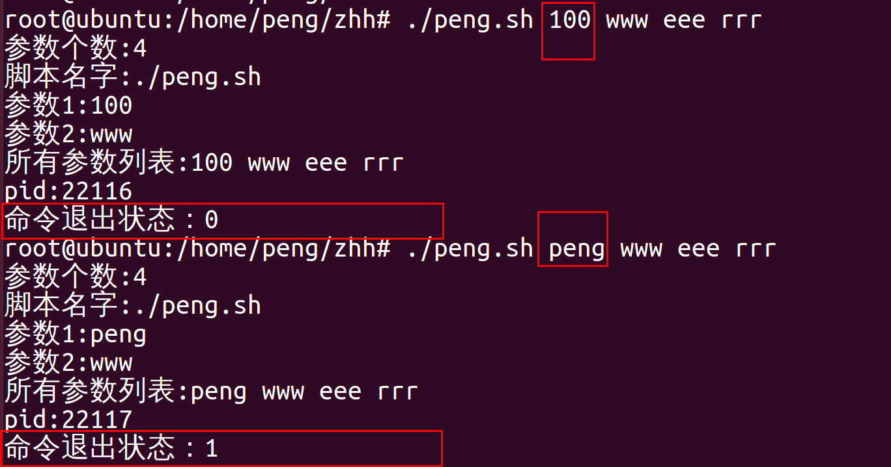
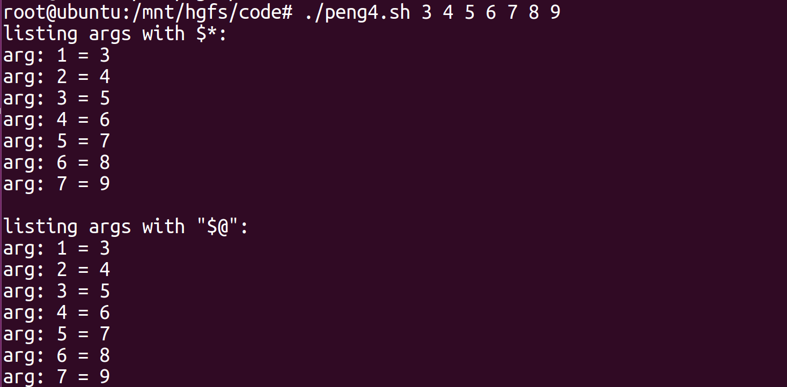
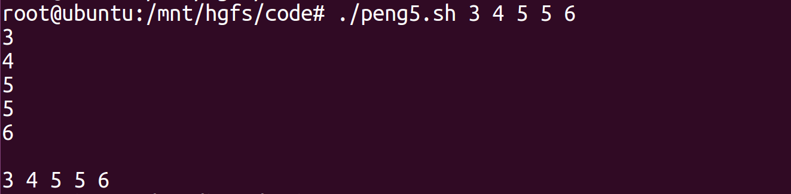

### 一、概述

shell中有两类字符：普通字符、元字符。

#### 1. 普通字符

在Shell中除了本身的字面意思外没有其他特殊意义，即普通纯文本；

#### 2. 元字符

是Shell的保留字符，在Shell中有着特殊的含义。





shell中字符`$`的各种用法。

### 二、[转义字符](https://so.csdn.net/so/search?q=转义字符&spm=1001.2101.3001.7020)$

在linux shell脚本中经常用到字符`$`，下面是`$`的一些常见用法

名称	含义
$#	传给脚本的参数个数
$0	脚本本身的名字
$1	传递给该shell脚本的第一个参数
$2	传递给该shell脚本的第二个参数
$@	传给脚本的所有参数的列表
$*	以一个单字符串显示所有向脚本传递的参数，与位置变量不同，参数可超过9个
$$	脚本运行的当前进程ID号
$?	显示最后命令的退出状态，0表示没有错误，其他表示有错误

#### 实例1

建立脚本peng.sh如下：

```bash
#/bin/bash
total=$[ $1 * $2 + $3 ]
echo "$1 * $2 + $3 = $total"
```

运行如下：

```bash
./peng.sh 4 5 6
1
```

结果如下：


#### 实例2

当把字符串输入给shell脚本的时候，注意是以空格作为分隔符，如果字符串本身就有空格的话，那么用双引号或者单引号，比如

```bash
#/bin/bash
echo "$1 is pretty nice!"
```

运行如下：

```bash
./peng.sh 一口Linux
```

结果如下：


#### 实例3

```bash
#!/bin/sh
echo "参数个数:$#"
echo "脚本名字:$0"
echo "参数1:$1"
echo "参数2:$2"
echo "所有参数列表:$@"
echo "pid:$$"
if [ $1 = 100 ]
then
 echo "命令退出状态：$?" 
 exit 0 #参数正确，退出状态为0
else
 echo "命令退出状态：$?"
 exit 1 #参数错误，退出状态1
fi
```

执行结果：



#### 实例4

使用for循环进行参数遍历

示例：

```
#!/bin/bash
number=65             #定义一个退出值
index=1               #定义一个计数器
if [ -z "$1" ];then   #对用户输入的参数做判断，如果未输入参数则返回脚本的用法并退出，退出值65
   echo "Usage:$0 + 参数"
   exit $number
fi
echo "listing args with \$*:"    #在屏幕输入，在$*中遍历参数
for arg in $*                                          
do
   echo "arg: $index = $arg"                 
   let index+=1
done
echo
index=1                         #将计数器重新设置为1
echo "listing args with \"\$@\":"    #在"$@"中遍历参数
for arg in "$@"
do
   echo "arg: $index = $arg"
   let index+=1
done

```




#### 实例5

小技巧1：在"∗ " 和 *"和∗"和*中遍历参数的区别

示例：

```
#!/bin/bash
number=11
if [ $# -eq 0 ];then
   echo "Usage: $0 + 参数"
   exit $number
fi
for i in $*               #在$*中遍历参数，此时每个参数都是独立的，会遍历$#次
do
   echo $i
done
echo
for i in "$*"            #在"$*"中遍历参数，此时"$*"被扩展为包含所有位置参数的单个字符串，只遍历一次
do
   echo $i
done

```



转：

[shell脚本中$0 $1 $# $@ $* $? $$ 的各种符号意义详解_shell $0-CSDN博客](https://blog.csdn.net/daocaokafei/article/details/120050007)
