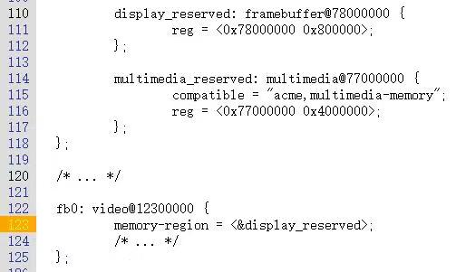

RESERVEDMEM_OF_DECLARE 对 dts 中预留的内存进行匹配和初始化

在 include/linux/of_reserved_mem.h 

```
struct reserved_mem {
	const char			*name;
	unsigned long			fdt_node;
	unsigned long			phandle;
	const struct reserved_mem_ops	*ops;
	phys_addr_t			base;
	phys_addr_t			size;
	void				*priv;
};

struct reserved_mem_ops {
	int	(*device_init)(struct reserved_mem *rmem,
			       struct device *dev);
	void	(*device_release)(struct reserved_mem *rmem,
				  struct device *dev);
};

typedef int (*reservedmem_of_init_fn)(struct reserved_mem *rmem);

#define RESERVEDMEM_OF_DECLARE(name, compat, init)			\  
	_OF_DECLARE(reservedmem, name, compat, init, reservedmem_of_init_fn)

```

## RESERVEDMEM_OF_DECLARE

RESERVEDMEM_OF_DECLARE 在 include/linux/of_reserved_mem.h 

_OF_DECLARE 在 include/linux/of.h 

```

#define RESERVEDMEM_OF_DECLARE(name, compat, init)			\  
	_OF_DECLARE(reservedmem, name, compat, init, reservedmem_of_init_fn)
//name 就是一个名称 ， 用来构建变量名称 
//compat 是字符串，和 dts 中的 compatible  字符串匹配 
//init 是一个函数 ， 这个函数 类型 需要 是  reservedmem_of_init_fn 这样的类型，即 返回 int , 参数为  reserved_mem 指针； 

#if defined(CONFIG_OF) && !defined(MODULE)	//确保不是在内核模块中使用
#define _OF_DECLARE(table, name, compat, fn, fn_type)			\
	static const struct of_device_id __of_table_##name		\
		__used __section("__" #table "_of_table")		\
		 = { .compatible = compat,				\
		     .data = (fn == (fn_type)NULL) ? fn : fn  }
#else
#define _OF_DECLARE(table, name, compat, fn, fn_type)//如果是在内核模块中使用			\
	static const struct of_device_id __of_table_##name		\
		__attribute__((unused))					\
		 = { .compatible = compat,				\
		     .data = (fn == (fn_type)NULL) ? fn : fn }
#endif
//构建一个 static 的 struct of_device_id  对象  __of_table__name  ，这个对象放在   __reservedmem_of_table   这个 section  里面 
//对象的 compatible 赋值为  compat 字符串；   .data 赋值为  fn 
//(fn==(fn_type)NULL)?  这个 检查， 主要作用就是 检查  fn 函数 类型  是 fn_type 。 如果不是，编译就会报错 

```

示例：

```

.dts

/{
	reserved-memory {
		#address-cells = <0x2>;
		#size-cells = <0x2>;
		ranges;

		minidump-elf-mem {
			compatible = "minidump-elf-reserved-memory";
			no-map;	//保留内存区域不应该被内核映射到虚拟地址空间，应用程序无法直接访问这块内存区域,它是专门留给内核使用的
			size = <0x0 0x1300000>;	//保留内存区域的大小
			alignment = <0x0 0x100000>;	//(1MB)对齐
			alloc-ranges = <0x0 0x40000000 0x0 0x40000000>;	//可以在物理地址范围0x40000000到0x80000000内分配
		};
	};
};

.c

phys_addr_t g_mindump_ram_phy_base;
EXPORT_SYMBOL(g_mindump_ram_phy_base);
unsigned long g_mindump_ram_len;
EXPORT_SYMBOL(g_mindump_ram_len);

int reserve_memory_minidump_elf_fn(struct reserved_mem *rmem)
{
	pr_info(DFT_TAG "[W]%s: name: %s,base: 0x%llx,size: 0x%llx\n",
		__func__, rmem->name, (unsigned long long)rmem->base,
		(unsigned long long)rmem->size);
	g_mindump_ram_phy_base = rmem->base;
	g_mindump_ram_len = rmem->size;
	return 0;
}

RESERVEDMEM_OF_DECLARE(minidump_elf_reserve_memory, "minidump-elf-reserved-memory",
			reserve_memory_minidump_elf_fn);
			
定义了 一个  
struct of_device_id    __of_device_minidump_elf_reserve_memory  =  {
	.compatible = "minidump-elf-reserved-memory" , 
	.data = reserve_memory_minidump_elf_fn 
} ; 
```

## dts 中reserved memory 解析和调用匹配的 of_device_id 的 .data 函数

```
 setup_arch
  --->arm64_memblock_init
         --->early_init_fdt_scan_reserved_mem
              --->fdt_init_reserved_mem
                    --->__reserved_mem_init_node
```

### fdt_init_reserved_mem

drivers/of/of_reserved_mem.c

```
void __init fdt_init_reserved_mem(void)
{
	int i;

	/* check for overlapping reserved regions */
	__rmem_check_for_overlap();

	for (i = 0; i < reserved_mem_count; i++) {	//处理每一块 reserved memory 
		struct reserved_mem *rmem = &reserved_mem[i];
		unsigned long node = rmem->fdt_node;
		int len;
		const __be32 *prop;
		int err = 0;
		bool nomap;

		nomap = of_get_flat_dt_prop(node, "no-map", NULL) != NULL;
		prop = of_get_flat_dt_prop(node, "phandle", &len);
		if (!prop)
			prop = of_get_flat_dt_prop(node, "linux,phandle", &len);
		if (prop)
			rmem->phandle = of_read_number(prop, len/4);

		if (rmem->size == 0) //如果还没有为 node 预留内存，则使用  __reserved_mem_alloc_size ，继续解析 node 的 dts 中的 参数，预留内存。
			err = __reserved_mem_alloc_size(node, rmem->name,
						 &rmem->base, &rmem->size);
		if (err == 0) { //说明预留内存成功， 对预留的这部分内存   调用 __reserved_mem_init_node 函数（下面详述） 
			err = __reserved_mem_init_node(rmem);
			if (err != 0 && err != -ENOENT) {	// 如果 __reserved_mem init node 失败了， 则需要释放 预留的这部分内存 先 memblock free 
				pr_info("node %s compatible matching fail\n",
					rmem->name);
				memblock_free(rmem->base, rmem->size);
				if (nomap)						//如果 有 nomap 属性，则还需要进一步把这块内存 add 到 memblock 的memory type 的 链表中
					memblock_add(rmem->base, rmem->size);
			}
		}
	}
}
```

###  __reserved_mem_init_node 

drivers/of/of_reserved_mem.c

```
static int __init __reserved_mem_init_node(struct reserved_mem *rmem)
{
	extern const struct of_device_id __reservedmem_of_table[];
	const struct of_device_id *i;
	int ret = -ENOENT;

	for (i = __reservedmem_of_table; i < &__rmem_of_table_sentinel; i++) {
		//对 rmem ，遍历    __reservedmem_of_table   这个 section  里面 的所有 of_device_id  对象 
		reservedmem_of_init_fn initfn = i->data;
		const char *compat = i->compatible;
		// rmem 的 fdt_node 和  of_device_id 对象的 compat  （char * 字符串）   进行匹配 
		if (!of_flat_dt_is_compatible(rmem->fdt_node, compat))
			continue;
		//匹配成功，调用 of_device_id 的 data 字段 里面存放的函数 。 initfn( rmem )
		ret = initfn(rmem);
		if (ret == 0) {
			pr_info("initialized node %s, compatible id %s\n",
				rmem->name, compat);
			break;
		}
	}
	return ret;
}
```

dts 中，通常使用 memory-region 将设备和 reserved memory 关联起来，如下：



 fb0 通过 memory-region 关联到 display_reserved 这块 reserved memory 上面；

## of_reserved_mem_device_init

include/linux/of_reserved_mem.h 

传入参数 dev， 找到 dev 中 memory-region 对应的 reserved memory .

然后调用 reserved_memory 对象的 ops->device_init( reserved_memory * rmem, device * dev );

```
static inline int of_reserved_mem_device_init(struct device *dev)
{
	return of_reserved_mem_device_init_by_idx(dev, dev->of_node, 0);
}
```

## of_reserved_mem_device_init_by_idx 

从 of_reserved_mem_device_init 进入时，dev , dev_node, idx = 0 ;

```
int of_reserved_mem_device_init_by_idx(struct device *dev,
				       struct device_node *np, int idx)
{
	struct rmem_assigned_device *rd;
	struct device_node *target;
	struct reserved_mem *rmem;
	int ret;

	if (!np || !dev)
		return -EINVAL;

	target = of_parse_phandle(np, "memory-region", idx); //通过 memory-region 找对应的 reserved memory 
	if (!target)
		return -ENODEV;

	if (!of_device_is_available(target)) {
		of_node_put(target);
		return 0;
	}

	rmem = __find_rmem(target);
	of_node_put(target);

	if (!rmem || !rmem->ops || !rmem->ops->device_init) //检查 有 rmem->ops   rmem->ops->device_init 函数 
		return -EINVAL;

	rd = kmalloc(sizeof(struct rmem_assigned_device), GFP_KERNEL);
	if (!rd)
		return -ENOMEM;

	ret = rmem->ops->device_init(rmem, dev); //调用  rmem->ops->device_init(rmem, dev) 
	if (ret == 0) { 						//成功的话，就 将 建立的对象 reserved_memory_device 
		rd->dev = dev; 
		rd->rmem = rmem;

		mutex_lock(&of_rmem_assigned_device_mutex);
		list_add(&rd->list, &of_rmem_assigned_device_list);//加入到  of_rmem_assigned_device_list 里面 ,记录 rmem 分配到 device 里面
		mutex_unlock(&of_rmem_assigned_device_mutex);

		dev_info(dev, "assigned reserved memory node %s\n", rmem->name);
	} else {
		kfree(rd);
	}

	return ret;
}
EXPORT_SYMBOL_GPL(of_reserved_mem_device_init_by_idx);
```
